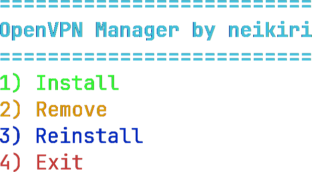

<p align="center">
  
  <span style="font-size: 32px; font-weight: bold; vertical-align: middle;">
    OpenVPN Auto Installer
  </span>
</p>

<p align="center">
  
  
  
  <br>
  
  
  
</p>

<p align="center">

  <a href="https://github.com/neikiri/openvpn-auto-installer/stargazers">
    
  </a>
  <a href="https://github.com/neikiri/openvpn-auto-installer/issues">
    
  </a>
  
  
</p>

---

<p align="center">
  
</p>


## ✨ Features

* ⚙️ Install OpenVPN server
* ❌ Remove OpenVPN server
* 🔄 Reinstall OpenVPN server
* 🌐 Auto-detect public network interface
* 🌍 Auto-detect public IPv4
* 📄 Generate client `.ovpn` profile
* 🔥 Automatic NAT (iptables) configuration
* 🔁 Enable IP forwarding
* 🎨 Colored terminal menu
* 💾 Persistent firewall rules (iptables-save)
* ⚡ CLI arguments support (non-interactive mode)

---

## 🐧 Supported systems

* Debian 11 / 12
* Ubuntu 20.04 / 22.04 / 24.04

---

## 📦 Installation

```bash
git clone https://github.com/neikiri/openvpn-auto-installer.git
cd openvpn-auto-installer
chmod +x openvpn-installer.sh
sudo ./openvpn-installer.sh
```

---

## ⚡ CLI Usage (Non-interactive mode)

You can run the script without menu:

```bash
sudo ./openvpn-installer.sh install
sudo ./openvpn-installer.sh remove
sudo ./openvpn-installer.sh reinstall
```

Show help:

```bash
sudo ./openvpn-installer.sh --help
```
---

## 📁 Output

Client config will be created in the home directory of the user running `sudo`:

```bash
/home/username/client.ovpn
```

---

## ⚠️ Warning

This script modifies:

* OpenVPN configuration
* iptables firewall rules
* system networking settings

👉 Use it only on a VPS or server where you understand these changes.

---

## 📄 License

This project is licensed under the MIT License — see the [LICENSE](LICENSE) file for details.

---

## 👨‍💻 Author

**neikiri**
GitHub: https://github.com/neikiri

## 📬 Contact

- 📧 Email: dev@neiki.eu